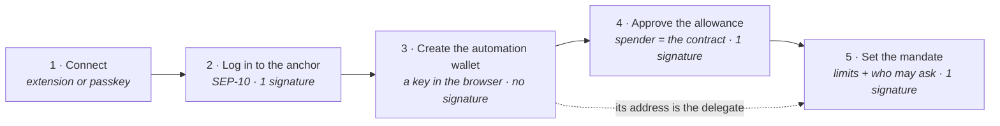
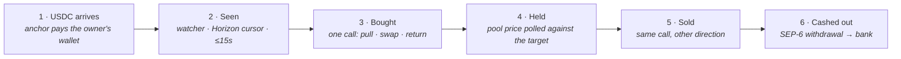
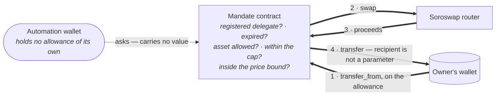

# Conduit


**A programmable TRY ⇄ Stellar rail.** Money enters from a Turkish bank account, follows a rule
the user signed once, and leaves back to the same bank account — without the user ever handing
over a private key.

- **Live:** [conduit-psi-three.vercel.app](https://conduit-psi-three.vercel.app)
- **Track:** Scale · **Network:** Stellar Testnet
- **Anchor:** `tr-mock-anchor.fly.dev` (SEP-1 / 6 / 10 / 12 / 38, TRY ⇄ USDC)
- **DEX:** Soroswap router contract, called directly on-chain
- **Skills used:** see [SKILLS.md](SKILLS.md)

---

## The problem

**Money that should follow a rule has to be watched by somebody, or held by somebody.**

Convert when the rate is right, keep a share in dollars, cash out when a target is hit — each is a
decision at a screen, and each screen is a chance to be late. The tools that would take those
decisions off you want custody in exchange: an exchange holds the balance, and a trading bot asks
for the private key. Automation and custody arrive as a package, and most people quite reasonably
decline the package and leave the money still.

The cost of that falls hardest on anyone earning in one currency and spending in another — a
freelancer paid in dollars, an exporter invoicing abroad, a household living on remittances, a
business taking stablecoin payments — and on anyone whose savings lose value while they wait for a
good moment to act.

**The value proposition: a rule that acts on your money without holding it.** Conduit separates
automation from custody. The rule is signed once and enforced by a Soroban contract; the funds
never leave the owner's wallet, the contract refuses anything outside the limits they set, and the
permission can be revoked in one call. Nothing in the system can move value to anywhere but back
to the owner.

Worth solving because the alternative is not inaction — it is worse decisions. A household in a
high-inflation economy that cannot automate ends up either holding a depreciating currency or
handing an exchange custody of everything. Stellar already carries the fiat rails and the
settlement; what has been missing is a way to let something act on them continuously without
first giving it the keys.

The rail built here is TRY ⇄ USDC through a Turkish anchor, because that is where the need is
sharpest and where an anchor was available. It is an instance, not the product: **any SEP-6 anchor
works, in any currency it settles.** The client is written against the standard rather than
against this anchor — no branch in it tests for lira, only for whether an asset is fiat — so
pointing it elsewhere is two settings:

```env
NEXT_PUBLIC_ANCHOR_HOME_DOMAIN=your-anchor.example
NEXT_PUBLIC_ANCHOR_FIAT_ASSET=iso4217:BRL
```

The anchor's own `stellar.toml` supplies the rest: endpoints, currencies, and the customer fields
SEP-12 will ask for. What stays local is one courtesy check — the payout field is validated as a
Turkish IBAN before it is sent, which a second market would want replaced with its own format.
Nothing downstream of the anchor changes at all: the mandate, the rule engine and the swap path
never learn which currency came in.

## What it does

```
TRY  ──SEP-6 deposit──▶  USDC  ──Soroswap──▶  asset  ──price target──▶  USDC  ──SEP-6 withdraw──▶  TRY
    (bank transfer)              (buy rule)              (sell rule)                  (bank transfer)
```

Every leg runs end to end on testnet:

| Leg | What happens |
|---|---|
| **On-ramp** | SEP-10 login → SEP-12 customer record → SEP-38 firm quote → SEP-6 deposit ([anchor.ts](src/lib/anchor.ts)) |
| **Trigger** | A watcher follows incoming USDC by Horizon cursor, so payments that landed while the tab was closed are still processed |
| **Buy** | *Portfolio* splits the arriving USDC across assets. *Buy & sell* takes one position on a price condition ([automation.ts](src/lib/automation.ts)) |
| **Sell** | An exit rule sells a configured share once the target is reached — only what this rule bought, and once |
| **Off-ramp** | The proceeds continue into a SEP-6 withdrawal to the registered IBAN, in the same rule execution |

The rule can be written as a form, or in plain language: a tool-calling model turns
*"40% XLM, 30% AQUA, leave the rest in dollars"* into fields, and asks a question rather than
inventing a number the user never gave ([ai/strategy.ts](src/lib/ai/strategy.ts)).

## Architecture

Three pictures, three questions: what the owner authorises, what happens afterwards without
them, and — since that is the part worth not taking on trust — who is able to move what during it.

The first two phases are where the product lives: the owner is in one and absent from the other.

**Phase 1 — set up once, in order**



Steps 4 and 5 are one button. Two things about them carry the whole design: the allowance names
**the mandate contract** as the spender rather than the automation wallet, so the wallet never
holds spending power of its own — and the mandate names that wallet as the only address allowed
to ask, alongside the limits any request has to fit.

Step 3 has no signature because nothing is authorised by it: it generates a key the browser can
sign with but cannot read back. Its address is what step 5 writes down.

**Phase 2 — runs on its own, in order, with no signature from the owner**



**Step 3 is one transaction, not three.** The contract pulls the USDC from the owner using the
allowance, swaps it through the router, and forwards the result — and if any part of that fails,
nothing moved at all. There is no moment where funds sit in the automation wallet, because they
never reach it.

Where the two rule modes diverge: **portfolio** stops at step 3, splitting each payment across
assets under the mandate. **Buy & sell** continues through step 6, and runs on the automation
wallet's own balance rather than under the mandate — see
[Status and limitations](#status-and-limitations) for why.

**Inside step 3 — who asks, who acts, where the value goes**



Thick arrows are value; the dotted one is a request. **No thick arrow touches the automation
wallet.** It can ask the contract to act and it can be refused, but nothing routes through it, so
there is no balance to drain and no address it could name instead of the owner's.

That is what bounds a stolen automation key. It cannot steal, because theft needs a recipient and
the recipient is fixed in the contract. It can force trades the owner did not want — inside the
assets, cap, price bounds and expiry the owner declared — which costs fees and slippage, not the
balance.

Everything the owner authorises happens in phase 1. Phase 2 contains no signature of theirs, and
no path that ends anywhere but back at their wallet.

| Component | Responsibility |
|---|---|
| [automation.ts](src/lib/automation.ts) | The rule engine. Watches Horizon by cursor, decides what each payment triggers, runs each allocation as its own swap, and records what it chose *not* to do |
| [mandate contract](contracts/mandate/src/lib.rs) | The only thing that can move the owner's funds. Holds the policy and enforces it on every call |
| [mandate.ts](src/lib/mandate.ts) | Client for that contract: set, execute, revoke, and rebuild a wallet's history from its events |
| [anchor.ts](src/lib/anchor.ts) | The whole SEP surface — discovery, auth, customer records, quotes, deposit and withdrawal |
| [api.ts](src/lib/api.ts) · [prices.ts](src/lib/prices.ts) | Soroswap: quotes and swaps simulated and submitted on-chain; spot prices read from pool reserves |
| [secure-key.ts](src/lib/secure-key.ts) · [passkey.ts](src/lib/passkey.ts) | Two keys that are never stored as text — the automation key, and the owner's when signing in without an extension |
| [api routes](src/app/api) | Thin proxies so the Telegram token and the model key stay on the server |

### Who signs

Two independent choices, not one setting. *Who signs the automation's trades* is the rule's mode;
*how the owner's own signature is obtained* is how they logged in. They combine:

| | **Owner signs each trade** | **Automation wallet signs** |
|---|---|---|
| **Wallet extension** | A prompt per trade. The rule waits for someone to be there | One mandate signature at setup, then silent. Bounded on chain by assets, cap, price and expiry |
| **Passkey** | **Silent for six hours — no delegation at all** | Same as above; the one mandate signature is also silent |

The lower-left cell is the one worth pausing on. A passkey session derives the owner's key on
demand, so in wallet mode the rule runs unattended while signing *as the owner*: no automation key
exists, no mandate is signed, and nothing has been delegated to anything. The limits are simply
the six hours and the open tab.

That is a different shape of safety from the mandate, not a weaker one. The mandate bounds an
authority that outlives the session and works while nobody is watching; this bounds the session
instead, and grants no authority at all. Which one fits depends on whether the rule needs to
survive closing the laptop — and the app states which is in force rather than leaving it to be
inferred.

**Three decisions shape the rest.** The watcher runs in the browser, because a server-side one
would need custody — the trade is that rules run while a tab is open. Quotes are read from the
chain rather than an indexer, because Soroswap's routing API does not index testnet pools. And
every amount is a decimal string end to end: no float touches a balance.

## The mandate: automation without custody

The owner signs one Soroban contract ([contracts/mandate](contracts/mandate/src/lib.rs), deployed
at `CAAPS6MYLC2DQ4TPOCRDKBCG4HVSQ35P4PCGQ7LAIISHQSPCP4RJ7DPO`) recording which assets may be
traded, how much may leave per window, the price bounds and an expiry. Three properties carry the
design:

**The allowance goes to the contract, never to the automation wallet.** The owner approves *this
contract* as the token spender, so the automation wallet holds no spending power of its own. It
can ask; the contract refuses anything the mandate does not cover. Revoking is one call.

**The proceeds cannot be redirected** — the recipient is not a parameter:

```rust
// Forward the proceeds; the contract holds nothing between calls.
TokenClient::new(&env, &asset_out).transfer(&contract, &owner, &amount_out);
```

A compromised automation key therefore cannot steal. It can force unwanted swaps inside the
owner's own declared limits — value erosion, not theft.

**Price bounds are enforced on the executed trade**, not on a reading taken beforehand. A bound
becomes the minimum output the swap must return, and the router reverts atomically if the market
cannot deliver it. No oracle to go stale, and no gap between checking a price and acting on it.

17 contract tests cover the cap resetting with its window, both bounds, expiry, revocation, a
wrong delegate, legs that bypass the base asset, and owner isolation.

### How this got here

Three attempts at the same problem, in order:

| | | Why it was not enough |
|---|---|---|
| **v1** | Grid bot; the automation wallet holds the balance ([/price](src/app/price/page.tsx)) — **the version that won DoraHacks** | Nothing on chain caps what it may do |
| **v2** | Classic multisig, bot as co-signer ([MultisigSwapTrader.ts](src/lib/MultisigSwapTrader.ts)) | Thresholds are per operation *category*, not per amount or asset; and 2-of-2 needs a signature per trade, which defeats automation |
| **v3** | Mandate contract | Current design |

`/price` is kept rather than deleted: it is the awarded version, and it is what made the shape of
the mandate obvious. Its key was brought up to the non-extractable model; its spending limits are
still v1, and the page says so.

### Where the keys live

The automation key is generated `extractable: false` and stored in IndexedDB as a `CryptoKey`
([secure-key.ts](src/lib/secure-key.ts)) — the browser signs with it but cannot read it back, so
there is no seed in storage to lift. Not a complete defence: a script on this origin can still
*use* it while the page is open. What it removes is exfiltration.

Signing in needs no extension either. [passkey.ts](src/lib/passkey.ts) derives a Stellar account
from WebAuthn's PRF output, so the user keeps a passkey their platform already syncs and no seed
is stored anywhere. Not a smart account, and the reason is the anchor: SEP-10 authenticates a
*classic keypair* signing a challenge, a contract account needs SEP-45, and this anchor serves
only the former — a smart account could not deposit or withdraw, which is most of the product.
The derived key is held six hours rather than for the life of the tab.

## Stellar integration

| SEP | Use |
|---|---|
| **SEP-1** | `stellar.toml` discovery |
| **SEP-10** | Challenge–response login; the challenge is verified *before* signing |
| **SEP-12** | Customer record and TRY payout IBAN |
| **SEP-38** | Firm quotes, and the TRY reference rate shown across the app |
| **SEP-6** | Programmatic deposit and withdrawal, with polling and status handling |
| **SEP-40** | Reflector oracle read, shown beside the pool price so the testnet gap is visible |
| **SEP-41** | `approve` / `transfer_from` / `balance` for delegated execution |

Quotes are read from the chain, not an indexer: Soroswap's routing API does not index testnet
pools, so [api.ts](src/lib/api.ts) keeps the SDK's call shape but simulates
`router_get_amounts_out` and submits the swap directly. Reference prices come from `get_reserves`,
which is spot — asking does not move it.

Three pitfalls that turned into code: withdrawals need the anchor's exact memo, so the client
refuses to send an unattributable payment when none comes back; deposits need a trustline first or
the anchor parks the payment in `pending_trust`; and a swap needs a trustline for **both** of its
assets — SAC error `#13` does not say which side failed, which sent one debugging session down the
wrong path.

## Deployed artifacts

All on **Stellar Testnet** (`Test SDF Network ; September 2015`). The mandate is the only contract
this project authors; the others are the deployments it is wired to, listed because the mandate
stores them and a reviewer can check the wiring without reading the source.

| What | ID | |
|---|---|---|
| **Mandate contract** *(ours)* | `CAAPS6MYLC2DQ4TPOCRDKBCG4HVSQ35P4PCGQ7LAIISHQSPCP4RJ7DPO` | [explorer](https://stellar.expert/explorer/testnet/contract/CAAPS6MYLC2DQ4TPOCRDKBCG4HVSQ35P4PCGQ7LAIISHQSPCP4RJ7DPO) |
| Soroswap router | `CCJUD55AG6W5HAI5LRVNKAE5WDP5XGZBUDS5WNTIVDU7O264UZZE7BRD` | [explorer](https://stellar.expert/explorer/testnet/contract/CCJUD55AG6W5HAI5LRVNKAE5WDP5XGZBUDS5WNTIVDU7O264UZZE7BRD) |
| Soroswap factory | `CDP3HMUH6SMS3S7NPGNDJLULCOXXEPSHY4JKUKMBNQMATHDHWXRRJTBY` | [explorer](https://stellar.expert/explorer/testnet/contract/CDP3HMUH6SMS3S7NPGNDJLULCOXXEPSHY4JKUKMBNQMATHDHWXRRJTBY) |
| Anchor USDC (SAC) | `CBIELTK6YBZJU5UP2WWQEUCYKLPU6AUNZ2BQ4WWFEIE3USCIHMXQDAMA` | issuer `GBBD47IF…LFLA5` |

Source: [contracts/mandate/src/lib.rs](contracts/mandate/src/lib.rs) — 401 lines, Soroban SDK,
with [17 tests](contracts/mandate/src/test.rs). Build and test it yourself:

```bash
cd contracts && cargo test              # 17 tests, no network needed
stellar contract build                  # wasm32v1-none
```

The deployed instance answers for its own configuration, so the table above can be verified rather
than trusted:

```bash
stellar contract invoke --id CAAPS6MY…7DPO --network testnet -- router
stellar contract invoke --id CAAPS6MY…7DPO --network testnet -- base
```

## Technical challenges

**A delegate that can act but cannot steal.** Classic multisig cannot express "at most X per day,
only this asset, only below this price" — thresholds are per operation *category*. The mandate
contract does, and the property that makes it safe is not the parameter list: the recipient of a
swap is not a parameter at all, so a compromised automation key can waste value but cannot
redirect it.

**Authorising a swap the contract does not itself perform.** The router moves the input out of the
mandate contract from a frame the contract does not own, and its own authorisation does not reach
that far down the stack. Exactly one sub-invocation is signed for — this pair, this amount, no
further calls — with `authorize_as_current_contract` ([lib.rs](contracts/mandate/src/lib.rs)),
rather than granting blanket authority for the call tree.

**Attributing a failure across three contracts.** One `execute` passes through the token, the
mandate and the router, and all three report failure as `Error(Contract, #N)`. The mandate's codes
start at 100 precisely so they cannot collide with the SAC's single digits or the router's 5xx —
which means a refusal can be traced to whoever actually refused instead of guessed at.

**A trustline error that names the wrong side.** SAC error `#13` is `TrustlineMissing` and does not
say which asset failed. An account cannot receive an asset it does not trust *or spend one*, so a
swap needs both legs open. Reporting only the output sent one debugging session down the wrong
path; both are opened before the transaction is built now.

**A price that is true and still refused.** The pool's spot price and the price a sale actually
fills at differ by the fee and the trade's own depth. The contract checks its bound on the fill, so
a rule comparing spot opened a band where it fired and the chain refused — every fifteen seconds,
forever. The same class of problem runs through the app: what the UI believes and what the chain
enforces are separate, and where they disagree the UI now shows both.

**Testnet pools nobody else trades.** A price-triggered rule waits for a market that does not move.
[scripts/pool.cjs](scripts/pool.cjs) moves it the way a trader would — buying through the router
from a throwaway Friendbot account until the pool sits at the target — so the exit can be
demonstrated firing on a real price rather than on a mock.

## Running it

**Prerequisites:** Node 18+, and a Stellar testnet wallet funded from
[friendbot](https://friendbot.stellar.org) — or no wallet at all, using a passkey.

```bash
git clone https://github.com/murat48/Conduit.git
cd conduit && npm install
touch .env.local             # see below
npm run dev                  # http://localhost:3000
```

```env
# Required
NEXT_PUBLIC_ANCHOR_HOME_DOMAIN=tr-mock-anchor.fly.dev
NEXT_PUBLIC_ANCHOR_FIAT_ASSET=iso4217:TRY   # any currency the anchor settles

# Optional
TELEGRAM_BOT_TOKEN=          # server-side only — never prefix with NEXT_PUBLIC_
AI_PROVIDER=anthropic        # or 'gemini'
ANTHROPIC_API_KEY=
GEMINI_API_KEY=
```

> Deploying publicly: `/api/ai/strategy` spends the key above with no authentication or rate
> limit, and `/api/telegram` proxies a single bot token. Both are fine for a single-operator demo
> and need attention before the link is shared widely.

### Walkthrough (≈10 minutes, all on testnet)

1. **Connect** — a wallet extension, or **Create passkey** for an account with no extension at
   all. A brand-new account offers to fund itself from Friendbot.
2. **Log in to the anchor** — one signature, no password.
3. **On-ramp** → request a TRY deposit. A sandbox button simulates the bank transfer; USDC arrives
   within seconds.
4. **Off-ramp** → save a TRY payout IBAN (SEP-12). Any valid-format IBAN works on testnet.
5. **Automation** → set a rule, choose **delegated** signing, approve the mandate once.
6. **Trigger it** — deposit again, or send USDC from anywhere. The watcher picks it up within 15
   seconds.
7. **History** shows every leg with its hash, verifiable on
   [stellar.expert](https://stellar.expert/explorer/testnet).

> Nobody else trades these pools, so a price target that is not already met will not be met on its
> own. To show the sell leg firing for real:
> ```
> node scripts/pool.cjs status                 # what every pool is priced at
> node scripts/pool.cjs push AQUA 0.0235384    # buy until the pool sits there
> ```
> It funds a throwaway Friendbot account, so it costs nothing and touches none of your keys.
>
> Thin testnet pools (EURC, XAU, ETH, SOL, BTC) will correctly refuse large amounts on price
> impact. Use XLM or AQUA for a smooth demo.

## Repository map

```
contracts/mandate/           # Soroban: the rule the owner signs, enforced on chain
scripts/pool.cjs             # testnet pools: read prices, or move one to a rule's target
src/
├── app/page.tsx             # the product: on-ramp · off-ramp · automation · AI · history
├── app/price/               # v1 grid bot (the awarded version)
├── app/api/                 # server-only proxies: ai, telegram
└── lib/
    ├── anchor.ts            # SEP-1/6/10/12/38 client
    ├── automation.ts        # rule engine: trigger → buy → exit → off-ramp
    ├── mandate.ts           # mandate client: set · execute · revoke · history
    ├── passkey.ts           # sign in with no extension: WebAuthn PRF → Ed25519
    ├── secure-key.ts        # non-extractable automation key in IndexedDB
    ├── api.ts               # Soroswap router, called on-chain
    └── ai/strategy.ts       # plain language → rule fields
```

**What is in the tree but not in the product.** Left deliberately, so that finding it is not a
surprise:

| Path | What it is | Reachable from the UI |
|---|---|---|
| [`src/app/price/`](src/app/price/page.tsx) | The v1 grid bot — the design this project grew out of. Its key was brought up to the non-extractable model; its spending limits are still v1, and the page says so. | By URL only |
| [`src/app/swap/`](src/app/swap/page.tsx) | A manual swap desk, sharing the router and quoting code with the rule engine. | By URL only |
| [`src/lib/MultisigSwapTrader.ts`](src/lib/MultisigSwapTrader.ts) + `/api/multisig-*`, `/api/test-bot-funding` | The v2 attempt: the bot as a classic co-signer. Kept as the evidence behind [why not multisig](#the-mandate-automation-without-custody). Nothing in the app calls these routes, and they need a secret this deployment does not set. | No |
| [`docs/pitch/`](docs/pitch) | The pitch deck and its build script. Not part of the app. | No |

## Status and limitations

**Working today:** the whole loop, on testnet, against a live anchor — including the mandate
contract, deployed and enforcing assets, cap, price bounds and expiry on chain rather than being a
plan.

- The anchor is a TRY **mock** anchor. Production needs a licensed one — the client is written
  against the SEPs and moves to another anchor or currency by configuration, but no licensed
  anchor has been tested against it.
- The rule lives in `localStorage`, so it runs **while a tab is open**. The payment trigger catches
  up on deposits that arrived while it was closed; a price-triggered exit does not.
- Testnet pool prices sit far from the real market — measured at the time of writing, XLM about
  41% below the Reflector rate. Rules fire on the pool's price, because that is the market the
  swap is filled in. The oracle rate is shown alongside so the gap is visible rather than
  misleading.
- **Buy & sell does not run under the mandate.** Its sell leg pulls the asset rather than USDC,
  which needs a second allowance, a re-signature whenever the target moves, and it opens a band
  between spot and the fill where the rule fires and the contract refuses. The guarantee is kept
  where it holds cleanly — portfolio mode — and buy & sell runs on the automation wallet's own
  budget instead.
- Buy & sell holds **one** position. Several price-conditional positions is a contract change, not
  a UI one: a mandate carries a single `buy_below` for every asset it covers, and one shared bound
  is meaningless across assets priced decades apart.
- `/price` still runs the v1 model: its wallet holds the balance it trades with, uncapped.

**Roadmap**

1. **Server-side watcher or permissionless keepers** — the mandate already makes this safe, since
   the contract decides what is allowed rather than the caller. Rules would keep running with the
   browser closed: the one structural limitation left.
2. **Per-asset price bounds in the mandate** — `assets` becomes a list of
   `{ asset, buy_below, sell_above }`, which is what buy & sell needs to run under it and to hold
   more than one position.
3. **Bring the mandate's limits to `/price`**, so the repository stops carrying two security
   models.
4. **Production anchor** and a TRY-denominated savings rule set.

## Demo

**[conduit-psi-three.vercel.app](https://conduit-psi-three.vercel.app)** — nothing costs anything:
fund from Friendbot, and the bank leg is simulated. A passkey is bound to the domain it was made
on, so one made here derives a different account from one made against a local dev server; the app
offers to fund the new one.

Video walkthrough: _<!-- fill in: re-record against the current flow -->_

---

Testnet software, built for a hackathon. Automated trading carries risk; nothing here is financial
advice. MIT — see [LICENSE](LICENSE).
