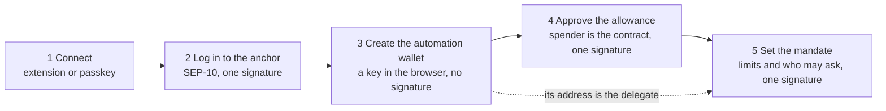
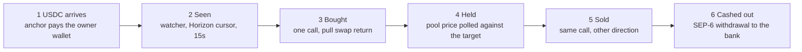

# Conduit

**Money that follows a rule you signed once — without giving anyone your keys.**

Lira arrives from a Turkish bank and becomes USDC. A rule you wrote takes it from there — **split
it across assets by percentage**, or **buy one and sell it at a price you set** — and the proceeds
go back to **your IBAN as lira**. A Soroban contract holds the rule and refuses everything outside
it.

[**Live on testnet →**](https://conduit-psi-three.vercel.app) · Mandate contract
[`CAAPS6MY…7DPO`](https://stellar.expert/explorer/testnet/contract/CAAPS6MYLC2DQ4TPOCRDKBCG4HVSQ35P4PCGQ7LAIISHQSPCP4RJ7DPO)
· Track: Scale · [SKILLS.md](SKILLS.md)

> **A stolen automation key cannot steal.** Theft needs a recipient, and in this contract the
> recipient is not a parameter:
>
> ```rust
> TokenClient::new(&env, &asset_out).transfer(&contract, &owner, &amount_out);
> ```
>
> The worst a compromised key can do is trade inside the limits the owner declared — fees and
> slippage, not the balance.

---

## Why it exists

**Automation and custody arrive as a package.** Anything that would act on your money continuously
wants to hold it first: an exchange takes the balance, a trading bot asks for the key. Most people
decline, and the money sits still.

The cost falls on anyone earning in one currency and spending in another — freelancers invoicing
abroad, exporters, households on remittances, businesses taking stablecoin payments — and on anyone
whose savings lose value while they wait for a good moment. **The alternative to automating is not
inaction; it is worse decisions.**

Conduit separates the two. The rule is signed once and enforced by a contract, the funds never
leave the owner's wallet, and the permission can be revoked in one call.

The rail built here is TRY ⇄ USDC through a Turkish anchor, because that is where the need is
sharpest and where an anchor was available. It is an instance, not the product: **any SEP-6 anchor
works, in any currency it settles** — no branch in the client tests for lira, only for whether an
asset is fiat, so pointing it elsewhere is two settings.

## What it does

```
TRY  ──SEP-6 deposit──▶  USDC  ──Soroswap──▶  asset  ──price target──▶  USDC  ──SEP-6 withdraw──▶  TRY
    (bank transfer)              (buy rule)              (sell rule)                  (bank transfer)
```

| Leg | What happens |
|---|---|
| **On-ramp** | SEP-10 login → SEP-12 customer record → SEP-38 firm quote → SEP-6 deposit ([anchor.ts](src/lib/anchor.ts)) |
| **Trigger** | A watcher follows incoming USDC by Horizon cursor, so payments that landed while the tab was closed are still processed |
| **Buy** | *Portfolio* splits the payment across assets. *Buy & sell* takes one position on a price condition ([automation.ts](src/lib/automation.ts)) |
| **Sell** | An exit rule sells a configured share at the target — only what this rule bought, and once |
| **Off-ramp** | The proceeds continue into a SEP-6 withdrawal to the registered IBAN, in the same execution |

The rule is a form, or plain language: a tool-calling model turns *"40% XLM, 30% AQUA, leave the
rest in dollars"* into fields, and asks a question rather than inventing a number the user never
gave ([ai/strategy.ts](src/lib/ai/strategy.ts)).

## The mandate

The owner signs one Soroban contract ([contracts/mandate](contracts/mandate/src/lib.rs)) recording
which assets may be traded, how much may leave per window, the price bounds and an expiry.

**Why a contract, and not the obvious options** — we built the first two:

| | Why it was not enough |
|---|---|
| **Fund a bot** *(v1, still how buy & sell runs)* | Nothing on chain caps what it does with the budget, and the money has already left the wallet |
| **Approve the bot** | A token allowance caps the amount and nothing else — which asset, at what price, how often all stay promises made off chain |
| **Classic multisig** *(v2)* | Thresholds are per operation *category*, not per amount or asset; and 2-of-2 needs a signature per trade, which defeats automating |

So the rule went into a contract. Three properties carry it:

- **The allowance is granted to the contract, never to the bot.** The bot holds no spending power
  of its own: it can ask, and be refused.
- **The recipient is fixed** — the quote at the top of this file. A compromised key cannot redirect
  anything.
- **Price bounds are enforced on the executed trade**, not on a reading taken beforehand. A bound
  becomes the swap's minimum output and the router reverts if the market cannot meet it. No oracle
  to go stale, no gap between checking a price and acting on it.

Revoking is one call. 17 tests cover the cap resetting with its window, both bounds, expiry,
revocation, a wrong delegate, legs that bypass the base asset, and owner isolation.

**How this got here.** v1 was a grid bot that held the funds — **the version that won DoraHacks**
([soroswap-quote-traders](https://github.com/murat48/soroswap-quote-traders),
[demo](https://youtu.be/RZaMhQO9pdw)), still shipped here as [/price](src/app/price/page.tsx). v2
was the multisig attempt ([MultisigSwapTrader.ts](src/lib/MultisigSwapTrader.ts)). v3 is the
contract. Both earlier attempts are still in the repository: the evidence of being wrong twice.

**Where the keys live.** The automation key is generated `extractable: false` and stored in
IndexedDB as a `CryptoKey` ([secure-key.ts](src/lib/secure-key.ts)) — the browser signs with it but
cannot read it back, so there is no seed to lift. Signing in needs no extension either:
[passkey.ts](src/lib/passkey.ts) derives a Stellar account from WebAuthn's PRF output. Not a smart
account, and the reason is the anchor — SEP-10 authenticates a *classic keypair* signing a
challenge, a contract account needs SEP-45, and this anchor serves only the former.

## How it works

Two phases. The owner is in the first and absent from the second — that gap is the product.

**Phase 1 — set up once, in order**



**Phase 2 — runs on its own, with no signature from the owner**



**Step 3 is one transaction, not three.** The contract pulls the USDC on the allowance, swaps
through the router and forwards the result; if any part fails, nothing moved. Funds never sit in
the automation wallet, because they never reach it.

Portfolio mode stops at step 3, under the mandate. Buy & sell continues through step 6 on the
automation wallet's own balance — see [what is honest about it](#what-is-honest-about-it).

| Component | Responsibility |
|---|---|
| [mandate contract](contracts/mandate/src/lib.rs) | The only thing that can move the owner's funds. Holds the policy and enforces it on every call |
| [automation.ts](src/lib/automation.ts) | The rule engine: watches Horizon by cursor, decides what each payment triggers, runs each allocation as its own swap, records what it chose *not* to do |
| [anchor.ts](src/lib/anchor.ts) | The whole SEP surface — discovery, auth, customer records, quotes, deposit and withdrawal |
| [mandate.ts](src/lib/mandate.ts) | Client for the contract: set, execute, revoke, and a wallet's history rebuilt from its events |
| [api.ts](src/lib/api.ts) · [prices.ts](src/lib/prices.ts) | Soroswap: swaps simulated and submitted on-chain; spot prices from pool reserves |
| [secure-key.ts](src/lib/secure-key.ts) · [passkey.ts](src/lib/passkey.ts) | Two keys never stored as text |
| [api routes](src/app/api) | Thin proxies, so the Telegram token and the model key stay on the server |

**Three decisions shape the rest.** The watcher runs in the browser, because a server-side one
would need custody — the trade is that rules run while a tab is open. Quotes are read from the
chain rather than an indexer, because Soroswap's routing API does not index testnet pools. Every
amount is a decimal string end to end: no float touches a balance.

## Deployed artifacts

All on **Stellar Testnet** (`Test SDF Network ; September 2015`). The mandate is the only contract
this project authors; the rest are what it is wired to, listed because the mandate stores them.

| What | ID |
|---|---|
| **Mandate contract** *(ours)* | [`CAAPS6MYLC2DQ4TPOCRDKBCG4HVSQ35P4PCGQ7LAIISHQSPCP4RJ7DPO`](https://stellar.expert/explorer/testnet/contract/CAAPS6MYLC2DQ4TPOCRDKBCG4HVSQ35P4PCGQ7LAIISHQSPCP4RJ7DPO) |
| Soroswap router | `CCJUD55AG6W5HAI5LRVNKAE5WDP5XGZBUDS5WNTIVDU7O264UZZE7BRD` |
| Soroswap factory | `CDP3HMUH6SMS3S7NPGNDJLULCOXXEPSHY4JKUKMBNQMATHDHWXRRJTBY` |
| Anchor USDC (SAC) | `CBIELTK6YBZJU5UP2WWQEUCYKLPU6AUNZ2BQ4WWFEIE3USCIHMXQDAMA` |

Source: [lib.rs](contracts/mandate/src/lib.rs), 401 lines, with [17 tests](contracts/mandate/src/test.rs).
The deployed instance answers for its own configuration, so the table can be verified rather than
trusted:

```bash
cd contracts && cargo test                                              # 17 tests, no network
stellar contract invoke --id CAAPS6MY…7DPO --network testnet -- router   # and -- base
```

## Built against Stellar

| SEP | Use |
|---|---|
| **1** | `stellar.toml` discovery |
| **10** | Challenge–response login; the challenge is verified *before* signing |
| **12** | Customer record and TRY payout IBAN |
| **38** | Firm quotes, and the TRY reference rate shown across the app |
| **6** | Programmatic deposit and withdrawal, with polling and status handling |
| **40** | Reflector oracle read, shown beside the pool price so the testnet gap is visible |
| **41** | `approve` / `transfer_from` / `balance` for delegated execution |

## What was hard

**Authorising a swap the contract does not itself perform.** The router moves the input out of the
mandate contract from a frame the contract does not own. Exactly one sub-invocation is signed for —
this pair, this amount, no further calls — rather than granting blanket authority for the call tree.

**Attributing a failure across three contracts.** One `execute` passes through the token, the
mandate and the router, and all three report failure as `Error(Contract, #N)`. The mandate's codes
start at 100 so they cannot collide with the SAC's single digits or the router's 5xx: a refusal can
be traced to whoever actually refused.

**A trustline error that names the wrong side.** SAC error `#13` does not say which asset failed.
An account cannot receive an asset it does not trust *or spend one*, so a swap needs both legs open.
Reporting only the output sent one debugging session down the wrong path.

**A price that is true and still refused.** Spot and the price a sale fills at differ by the fee and
the trade's own depth. The contract checks its bound on the fill, so a rule comparing spot opened a
band where it fired and the chain refused — every fifteen seconds, forever. The lesson runs through
the app: what the UI believes and what the chain enforces are separate, and where they disagree the
UI shows both.

**Testnet pools nobody else trades.** A price-triggered rule waits for a market that does not move.
[scripts/pool.cjs](scripts/pool.cjs) moves it the way a trader would, from a throwaway Friendbot
account, so the exit can be demonstrated firing on a real price.

## Running it

```bash
git clone https://github.com/murat48/Conduit.git
cd conduit && npm install
touch .env.local             # see below
npm run dev                  # http://localhost:3000
```

```env
NEXT_PUBLIC_ANCHOR_HOME_DOMAIN=tr-mock-anchor.fly.dev
NEXT_PUBLIC_ANCHOR_FIAT_ASSET=iso4217:TRY   # any currency the anchor settles

# Optional
TELEGRAM_BOT_TOKEN=          # server-side only — never prefix with NEXT_PUBLIC_
AI_PROVIDER=anthropic        # or 'gemini'
ANTHROPIC_API_KEY=
GEMINI_API_KEY=
```

> Deploying publicly: `/api/ai/strategy` spends the key above with no authentication or rate limit,
> and `/api/telegram` proxies a single bot token. Fine for a single-operator demo; both need
> attention before the link is shared widely.

**Walkthrough (≈10 minutes, all on testnet).** Connect — a wallet extension, or **Create passkey**
for an account with nothing to install; a new account offers to fund itself from Friendbot. Log in
to the anchor, request a TRY deposit and press the sandbox button; USDC arrives in seconds. Save a
payout IBAN, set a rule, approve the mandate once — then deposit again and watch it run. Every leg
shows a hash, verifiable on [stellar.expert](https://stellar.expert/explorer/testnet).

> Nobody else trades these pools, so a price target that is not already met will not be met on its
> own. To show the sell leg firing for real:
> ```bash
> node scripts/pool.cjs status                 # what every pool is priced at
> node scripts/pool.cjs push AQUA 0.0235384    # buy until the pool sits there
> ```
> It funds a throwaway Friendbot account, so it costs nothing and touches none of your keys. Thin
> pools (EURC, XAU, ETH, SOL, BTC) will correctly refuse large amounts on price impact — use XLM or
> AQUA for a smooth demo.

## What is honest about it

The whole loop works end to end on testnet against a live anchor, with the mandate contract
deployed and enforcing assets, cap, price bounds and expiry. What it does not do yet:

- **The anchor is a mock.** Production needs a licensed one. The client is written against the
  SEPs and moves by configuration, but no licensed anchor has been tested against it.
- **Rules run while a tab is open.** The payment trigger catches up on deposits that arrived while
  it was closed; a price-triggered exit does not.
- **Buy & sell does not run under the mandate.** Its sell leg pulls the asset rather than USDC,
  which needs a second allowance, a re-signature whenever the target moves, and it opens a band
  between spot and the fill where the rule fires and the contract refuses. The guarantee is kept
  where it holds cleanly — portfolio mode — and buy & sell runs on a set-aside budget instead.
- **Buy & sell holds one position.** Several price-conditional positions is a contract change: a
  mandate carries a single `buy_below` for every asset it covers, and one shared bound is
  meaningless across assets priced decades apart.
- **Testnet pools sit far from the real market** — XLM about 41% below the Reflector rate when
  measured. Rules fire on the pool's price, because that is the market the swap fills in; the
  oracle rate is shown alongside so the gap is visible rather than misleading.

**Roadmap**

1. **Keepers, so rules survive a closed laptop.** The one structural limitation left — and the
   mandate already makes it safe, since the contract decides what is allowed rather than the
   caller. A keeper that cannot exceed the rule does not need to be trusted.
2. **Per-asset price bounds in the mandate.** `assets` becomes a list of
   `{ asset, buy_below, sell_above }`. This is what buy & sell needs to run under the contract,
   and what holding more than one price-conditional position needs.
3. **A production anchor, then more corridors.** Lira is the corridor we could reach; the argument
   is the same wherever income and costs are in different currencies. The client already moves by
   configuration, so BRL, MXN or ARS are an anchor away, not a rewrite.
4. **More assets as their pools deepen** — USDT0 among them. Adding one is a row in a table; what
   the code cannot do is create liquidity, and on testnet today nine of the thirteen listed assets
   hold under 8,000 USDC. A price-impact ceiling protects users from that, but the honest answer
   is that depth has to arrive first.
5. **Yield on idle balances** via Blend or DeFindex, so USDC waiting for a rule to fire is not
   sitting still. This extends the mandate rather than sitting beside it: another thing the
   contract would be allowed to do, inside the same limits.
6. **MPC for the automation key**, so no single party holds it whole. Passkeys do not help here —
   WebAuthn needs user presence for every signature, and this key exists to sign when nobody is
   present.

## Also in the tree

Kept on purpose, so that finding it is not a surprise: [/price](src/app/price/page.tsx) (the v1
grid bot, reachable by URL), [/swap](src/app/swap/page.tsx) (a manual swap desk),
[MultisigSwapTrader.ts](src/lib/MultisigSwapTrader.ts) and its `/api/multisig-*` routes (the v2
attempt — nothing in the app calls them), and [docs/pitch/](docs/pitch) (the pitch deck).

---

Testnet software, built for a hackathon. Automated trading carries risk; nothing here is financial
advice. MIT — see [LICENSE](LICENSE).
