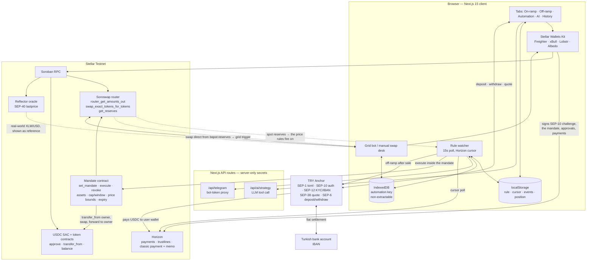

# Conduit


**A programmable TRY ⇄ Stellar rail.** Money enters from a Turkish bank account, follows a rule
the user signed once, and leaves back to the same bank account — without the user ever handing
over a private key.

- **Track:** Scale
- **Network:** Stellar Testnet
- **Anchor:** `tr-mock-anchor.fly.dev` (SEP-1 / 6 / 10 / 12 / 38, TRY ⇄ USDC)
- **DEX:** Soroswap router contract, called directly on-chain
- **Skills used:** see [SKILLS.md](SKILLS.md)

---

## 1. The problem

A freelancer in Istanbul invoices a client abroad and is paid in dollars. Today that money has to
be watched by hand: convert now or wait, split it into savings, cash out to lira when the rate is
right. Every step is a manual decision at a screen, and each one is a chance to be late.

Crypto tooling does not fix this. A DEX can swap, but it cannot reach a bank account. An exchange
can reach a bank account, but only by taking custody of the funds first. And the automation that
does exist — trading bots — asks for the one thing nobody should give away: the private key.

**Conduit closes the loop.** It connects a Turkish bank account to on-chain execution on both
ends, and it runs the middle automatically under a mandate the user can revoke at any moment.

> **Who benefits:** freelancers and exporters with foreign-currency income, and anyone in a
> high-inflation economy who wants a rule — not a screen — deciding when their money moves.

## 2. What it does

One rule covers the whole cycle:

```
TRY  ──SEP-6 deposit──▶  USDC  ──Soroswap──▶  asset  ──price target──▶  USDC  ──SEP-6 withdraw──▶  TRY
    (bank transfer)              (buy rule)              (sell rule)                  (bank transfer)
```

Every leg is implemented and runs end to end on testnet:

| Leg | What happens | Code |
|---|---|---|
| **On-ramp** | SEP-10 login → SEP-12 customer record → SEP-38 firm quote → SEP-6 deposit. The anchor returns bank instructions; the USDC lands in the user's own wallet. | [anchor.ts](src/lib/anchor.ts) |
| **Trigger** | A watcher follows the wallet's incoming USDC payments on Horizon by cursor, so payments that arrived while the tab was closed are still processed. | [automation.ts:770](src/lib/automation.ts#L770) |
| **Buy** | *Portfolio mode* splits the arriving USDC across assets by percentage or fixed amount. *Trade mode* buys a single asset, optionally only while its price is below a threshold. | [automation.ts:368](src/lib/automation.ts#L368) |
| **Sell** | An exit rule watches the asset's USDC price and sells a configured share once the target is reached. Sells only what this rule bought, and fires once so a price hovering at the threshold cannot sell repeatedly. | [automation.ts:628](src/lib/automation.ts#L628) |
| **Off-ramp** | With `offramp` set, the proceeds continue straight into a SEP-6 withdrawal to the user's registered IBAN — in the same rule execution as the sale. | [automation.ts:722](src/lib/automation.ts#L722) |

Two ways to author the rule:

- **Form** — allocation rows, thresholds, price-impact ceiling, minimum USD/TRY gate.
- **Plain language** — "keep half in dollars, buy gold with the rest, cash out to lira if gold
  passes $4,200" is turned into rule fields by a tool-calling LLM that asks a clarifying question
  instead of guessing a number the user did not state ([ai/strategy.ts](src/lib/ai/strategy.ts)).

Alongside the anchor rail, [/price](src/app/price/page.tsx) is the **v1 grid bot — the version
that won DoraHacks** — kept as a working exhibit of the design this project grew out of. It runs
one buy-low/sell-high cycle on a chosen pair from its own automation wallet. [§4.1](#41-how-this-got-here)
is the three-step story from there to the mandate contract. [/swap](src/app/swap/page.tsx) is a
manual swap desk. Both share the same router and quoting code as the automation engine.

## 3. Architecture



**Why the parts sit where they do**

- **The watcher runs in the browser, not on a server.** A server-side watcher would need custody
  of the user's key. Instead the rule, its cursor and its position ledger live in `localStorage`,
  and execution is authorised per transaction — by the wallet, or by the mandate contract.
- **The automation key is in IndexedDB, not `localStorage`.** Not for tidiness: `localStorage`
  stores strings, so a key kept there has to be serialised into readable text. IndexedDB stores
  the `CryptoKey` object itself, which is what makes a non-extractable key storable at all.
- **Secrets never reach the client.** The Telegram token and the LLM key are read only inside API
  routes; the browser talks to thin proxies. No `NEXT_PUBLIC_` key in the app is a secret.
- **Quotes are read from the chain, not from an indexer.** Soroswap's Routing API does not index
  testnet pools (`/pools?network=testnet` returns empty while the factory holds 236 live pairs),
  so [api.ts](src/lib/api.ts) keeps the SDK's `getQuote → buildTransaction → sendTransaction`
  shape but simulates `router_get_amounts_out` and submits `swap_exact_tokens_for_tokens`
  directly. Reference prices come from `get_reserves` — spot, so quoting does not move the price.

## 4. Delegation: automation without giving up the key

The hard part of "act on my behalf" is doing it without custody. Conduit offers three levels,
and the UI states which one is in force:

| Mode | Who signs | What the user gives up |
|---|---|---|
| **Wallet** | The user approves each transaction in the wallet | Nothing — but the rule cannot fire while the wallet is away |
| **Delegated** *(recommended)* | The automation wallet asks the mandate contract, which enforces the limits | A capped, expiring, revocable permission. Funds never leave the user's wallet |
| **Bot wallet** | The automation wallet holds a balance and signs silently | The set-aside balance. No on-chain cap — this is the v1 model, kept for `/price` and for buy & sell |

### Signing in without an extension

A wallet extension is the first thing the product asks for and the first place people stop, so
there is a second way in: **Create passkey** derives a Stellar account from the passkey itself
([passkey.ts](src/lib/passkey.ts)). WebAuthn's PRF extension returns the same 32 bytes for a given
credential every time and returns them to nobody who cannot satisfy the authenticator, so those
bytes seed an Ed25519 key. The user keeps a passkey their platform already syncs; the app gets an
ordinary `G…` account for as long as the tab is open, and no seed is stored anywhere.

**Why not a smart account.** The usual design — a contract account verifying secp256r1, so the
passkey signs for the chain directly — cannot be used here, and the reason is the anchor. SEP-10
authenticates by having a *classic keypair* sign a challenge transaction. A contract account has
no such key; it authenticates with SEP-45, which this anchor does not serve (its `stellar.toml`
carries `WEB_AUTH_ENDPOINT` and nothing else). A smart account would therefore be unable to
deposit or withdraw — which is most of the product. Deriving a classic key keeps SEP-10, SEP-6,
the mandate and every signature path working unchanged, and still removes the extension. The
honest description is passkey *authentication*, not on-chain passkey *authorisation*: the chain
sees an ordinary account. Making it the other kind is a SEP-45 problem on the anchor, not a
client one.

**The key is held for six hours, not for the tab.** A key that lives as long as the page does is
readable by anything running on the origin for that whole time, which is the property a wallet
extension exists to avoid; deriving one per signature avoids it completely but asks for a touch on
every transaction, which is enough friction during a working session that people look for a way
around it. So the unlock is bounded, and measured from the sign-in rather than from the last use —
a window that slid forward on every use would stay open as long as someone kept working, which is
not a limit. Signing out closes it at once.

PRF is an extension an authenticator may decline, so support is found out by asking rather than
guessed from a version string — and the wallet button stays beside it either way.

### The mandate contract

Delegated mode runs through a Soroban contract the owner signs once
([contracts/mandate/src/lib.rs](contracts/mandate/src/lib.rs), deployed at
`CAAPS6MYLC2DQ4TPOCRDKBCG4HVSQ35P4PCGQ7LAIISHQSPCP4RJ7DPO`). A mandate records which assets may
be traded, how much base asset may leave per time window, the price bounds, and an expiry ledger.

Three properties matter more than the parameter list:

**The allowance goes to the contract, never to the automation wallet.** The owner approves *this
contract* as the token spender, so the automation wallet holds no spending power of its own — it
can ask the contract to act, and the contract refuses anything the mandate does not cover.

**The proceeds cannot be redirected.** The recipient is not a parameter:

```rust
// Forward the proceeds; the contract holds nothing between calls.
TokenClient::new(&env, &asset_out).transfer(&contract, &owner, &amount_out);
```

A compromised automation key therefore cannot steal. It can force unwanted swaps inside the
owner's own declared limits — value erosion through fees and slippage, not theft.

**Price bounds are enforced on the executed trade, not on a reading taken beforehand.** A bound is
converted into the minimum output the swap must return, and the router reverts atomically if the
market cannot deliver it. There is no oracle to go stale and no gap between checking a price and
acting on it.

Revoking is one `revoke` call, or letting the mandate expire.

### Why not classic multisig

Classic Stellar multisig cannot express this. Thresholds are per operation *category*
(low/medium/high), not per amount or per asset, so a medium-weight signer can move everything. And
a 2-of-2 account needs the owner's signature on every trade, which removes the reason to automate
at all. That attempt is still in the tree as [MultisigSwapTrader.ts](src/lib/MultisigSwapTrader.ts)
— see [§4.1](#41-how-this-got-here) for why it was replaced rather than finished.

### Where the automation key lives

The automation wallet's key is generated with `extractable: false` and stored in IndexedDB as a
`CryptoKey` ([secure-key.ts](src/lib/secure-key.ts)). The browser signs with it but cannot read it
back — `exportKey` on the private half throws. Nothing is written to storage as text, so there is
no seed for a stray script to lift and reuse elsewhere.

That is not a complete defence: any script running on this origin can still *use* the key while
the page is open. What it removes is exfiltration — the difference between a one-time compromise
that lasts forever from anywhere, and abuse bounded to a live session and to the mandate's limits.

The trade is that the key cannot be backed up. Losing it costs one `set_mandate` to name the
replacement, and the rule engine checks for exactly that drift before it spends a fee finding out
([automation.ts](src/lib/automation.ts) → `mandateProblem`), because the contract's own refusal
arrives as an auth trap with the failing address buried in diagnostic events.

### 4.1 How this got here

The three signing models above are not alternatives offered for taste. They are three attempts at
the same problem, in order:

| | What it did | Why it was not enough |
|---|---|---|
| **v1 — grid bot** ([/price](src/app/price/page.tsx)) | An automation wallet holds a balance and trades buy-low/sell-high on one pair. **This is the version that won DoraHacks.** | The wallet holds the funds, and nothing on chain caps what it may do with them |
| **v2 — classic multisig** ([MultisigSwapTrader.ts](src/lib/MultisigSwapTrader.ts)) | Add the bot as a co-signer on the user's own account, so funds never move out | Thresholds cannot express "at most X per day, only this asset, only below this price"; and 2-of-2 needs a signature per trade, which defeats automation |
| **v3 — mandate contract** ([contracts/mandate](contracts/mandate)) | The owner signs one policy; a contract enforces assets, cap per window, price bounds and expiry | Current design |

`/price` is kept deliberately rather than deleted: it is the awarded version, and it is the thing
that made the shape of the mandate obvious. Its key was brought up to the non-extractable model,
but its spending limits are still the v1 ones, and the page says so at the top.

## 5. Stellar integration

**SEPs implemented** ([anchor.ts](src/lib/anchor.ts), [types/anchor.ts](src/types/anchor.ts)):

| SEP | Use |
|---|---|
| **SEP-1** | `stellar.toml` discovery of the anchor's endpoints and currencies |
| **SEP-10** | Challenge–response login; the challenge is verified *before* signing (server signature, sequence 0, source account, home domain, `web_auth_domain`) |
| **SEP-12** | Customer record and TRY payout IBAN, with field requirements read from the anchor |
| **SEP-38** | Firm quotes and indicative prices for TRY ⇄ USDC; also the TRY reference rate shown across the app |
| **SEP-6** | Programmatic deposit and withdrawal, with polling and status handling |
| **SEP-40** | Reflector oracle read for the real-world XLM/USD rate, shown next to the pool price so the testnet gap is visible ([reflector.ts](src/lib/reflector.ts)) |
| **SEP-41** | Token interface — `approve` / `transfer_from` / `balance` for delegated execution |

**Pitfalls that turned into code** — these came out of the anchors skill and out of live responses:

- Withdrawals require the anchor's exact `memo` / `memo_type`; the module refuses to send a
  payment when the anchor returns none, rather than sending an unattributable transfer.
- Deposits need a trustline first, or the anchor parks the payment in `pending_trust`. The UI
  opens the trustline before the deposit starts ([trustline.ts](src/lib/trustline.ts)).
- Firm quotes expire. An expired quote falls back to the live rate and the UI never presents the
  quoted amount as final.
- This anchor answers `403 {"type":"authentication_required"}` rather than `401`;
  `pollTransaction` re-authenticates once mid-flow when that happens.
- Amounts are decimal strings end to end. No floats touch a balance.
- A swap needs a trustline for **both** of its assets, not just the output. SAC error
  `#13` is `TrustlineMissing` and does not say which side failed — an account cannot receive an
  asset it does not trust, and cannot spend one either. Naming only the output in the error message
  sent one debugging session down the wrong path, so both legs are now opened before the build.
- The mandate records the one automation wallet it accepts calls from. When the local key has been
  regenerated since, the contract's refusal surfaces as an auth trap with the failing address
  buried in diagnostic events, so the rule engine compares the two addresses first and says which
  is which.

## 6. Running it

**Prerequisites:** Node 18+, a Stellar testnet wallet (Freighter, xBull, Lobstr or Albedo) funded
with testnet XLM.

```bash
git clone https://github.com/murat48/conduit.git
cd conduit
npm install
touch .env.local             # then fill in the values below
npm run dev                  # http://localhost:3000
```

Only the anchor domain is required to see the full flow; the rest are optional:

```env
# Anchor — no API key, the user's keypair is the identity
NEXT_PUBLIC_ANCHOR_HOME_DOMAIN=tr-mock-anchor.fly.dev

# Optional: Telegram notifications (server-side only — never prefix with NEXT_PUBLIC_)
TELEGRAM_BOT_TOKEN=

# Optional: plain-language strategy assistant
AI_PROVIDER=anthropic          # or 'gemini'
ANTHROPIC_API_KEY=
GEMINI_API_KEY=
```

> Deploying this publicly: `/api/ai/strategy` spends the key above and has no authentication or
> rate limit, and `/api/telegram` proxies a single bot token, so its chat-id lookup reads whichever
> chat wrote to that bot last. Both are fine for a single-operator demo and need attention before
> the link is shared widely.

### Walkthrough for reviewers (≈10 minutes, all on testnet)

1. **Connect** on `/` — a wallet extension, or **Create passkey** for an account with no
   extension at all. Fund it from [friendbot](https://friendbot.stellar.org) if needed.
2. **Log in to the anchor** — step 2 on the page. One signature, no password.
3. **On-ramp tab** → request a TRY deposit. The anchor returns bank instructions and a sandbox
   button simulates the incoming bank transfer; USDC arrives in your wallet within seconds.
4. **Off-ramp tab** → save a TRY payout IBAN (SEP-12). Any valid-format IBAN works on testnet.
5. **Automation tab** → set a rule. The quickest end-to-end demo:
   *trade mode → asset XLM → buy 50% → sell above `<slightly under the current price>` →
   off-ramp on.* Choose **delegated** signing and approve the allowance once.
6. **Trigger it** — run another on-ramp deposit, or send USDC to the wallet from anywhere. The
   watcher picks the payment up within 15 seconds, buys, and — once the sell threshold is met —
   sells and cashes out to the IBAN.
   > Nobody else trades these pools, so a price target that is not already met will not be met on
   > its own. To show the sell leg firing for real rather than waiting on a price that cannot
   > move, push the pool to the target from another terminal:
   >
   > ```
   > node scripts/pool.cjs status                 # what every pool is priced at right now
   > node scripts/pool.cjs push AQUA 0.0235384    # buy until the pool sits at that price
   > ```
   >
   > It funds a throwaway Friendbot account and spends its XLM, so it costs nothing and touches
   > none of your keys — the rule then fires on its next tick, from its own signature. Add `--dry`
   > to see the size of the swap without sending it.
7. **History tab** shows every leg with its transaction hash; each is verifiable on
   [stellar.expert](https://stellar.expert/explorer/testnet).
8. Optional: **`/price`** for the v1 grid bot — worth opening to see what the mandate replaced, and
   why ([§4.1](#41-how-this-got-here)). **`/swap`** for manual swaps.

> Testnet pools for thin assets (EURC, XAU, ETH, SOL, BTC) are shallow — the price-impact ceiling
> will correctly refuse large amounts. Use XLM, AQUA or USDC for a smooth demo.

## 7. Repository map

```
contracts/
└── mandate/                  # Soroban: the rule the owner signs, enforced on chain

scripts/
└── pool.cjs                  # testnet pools: read prices, or move one to a rule's target

src/
├── lib/passkey.ts            # sign in without an extension: WebAuthn PRF → Ed25519 account
├── app/
│   ├── page.tsx              # the product: on-ramp · off-ramp · automation · AI · history
│   ├── price/                # v1 grid bot (the awarded version) — see §4.1
│   ├── swap/                 # manual swap desk
│   └── api/                  # server-only proxies: ai, telegram
├── lib/
│   ├── anchor.ts             # SEP-1/6/10/12/38 client
│   ├── automation.ts         # rule engine: trigger → buy → exit → off-ramp
│   ├── mandate.ts            # mandate contract client: set · execute · revoke · history
│   ├── allowance.ts          # SEP-41 approve / transfer_from delegation
│   ├── api.ts                # Soroswap router, called on-chain
│   ├── prices.ts             # pool-reserve spot prices — the price rules fire on
│   ├── reflector.ts          # SEP-40 oracle read, shown as a real-world reference
│   ├── trustline.ts          # trustline discovery and creation
│   ├── secure-key.ts         # non-extractable automation key in IndexedDB
│   ├── bot-wallet.ts         # automation wallet: load · create · sign · sweep-back
│   └── ai/strategy.ts        # plain language → rule fields
└── types/                    # anchor + app types, verified against live responses
```

## 8. Status, limitations, roadmap

**Working today:** the entire loop above, on testnet, against a live anchor — including the
mandate contract, which is deployed and enforcing assets, spend cap, price bounds and expiry on
chain rather than being a plan.

**Honest limitations:**

- The anchor is a TRY mock anchor on testnet. Production needs a licensed Turkish anchor; the
  client code is SEP-compliant and switches by changing one domain.
- The rule and its cursor live in `localStorage`, so the rule executes while a browser tab is
  open. The payment trigger catches up on deposits that arrived while the tab was closed; a
  price-triggered exit does not fire until the tab is open again.
- Testnet pool prices sit a long way from the real market — measured at the time of writing, the
  XLM/USDC pool priced XLM about 41% below the Reflector oracle's real-world rate. Rules therefore
  fire on the pool's own price, because that is the market the swap is filled in and the one the
  mandate's bounds are checked against. The oracle rate is shown alongside so the gap is visible
  rather than misleading.
- `/price` still runs the v1 model: its automation wallet holds the balance it trades with, and no
  on-chain cap applies to it.
- Buy & sell mode holds one position at a time. Splitting an incoming payment across several
  assets is what portfolio mode does; what is missing is several *price-conditional* positions at
  once. That is a contract change, not a UI one — a mandate carries a single `buy_below` and
  `sell_above` for every asset it covers, and one shared bound is meaningless across assets priced
  decades apart. Scoped out deliberately rather than solved in the browser, which would have moved
  the price decision back off chain.

**Roadmap**

1. **Server-side watcher or permissionless keepers.** The mandate already makes this safe: the
   contract, not the caller, decides what is allowed. Rules would then keep running with the
   browser closed — the one structural limitation left.
2. **Bring the mandate's limits to `/price`**, so the awarded grid bot gains the same on-chain
   cap the home-page automation has, and the repository stops carrying two security models.
3. **Per-asset price bounds in the mandate** — `assets: Vec<Address>` becomes a list of
   `{ asset, buy_below, sell_above }`, which is what buy & sell mode needs to hold more than one
   position at a time. The enforcement already exists; it is the shape that is singular.
4. **Yield on idle balances** via Blend or DeFindex, so USDC waiting for a rule to fire is not
   sitting still. This extends the mandate rather than sitting beside it.
5. **MPC for the automation key**, so no single party holds it whole. Passkeys do not help here:
   WebAuthn requires user presence for every signature, and the automation key exists precisely
   to sign when nobody is present.
6. **Production anchor integration** and a TRY-denominated savings rule set.

**Continuity:** _<!-- fill in: SCF / InstaAwards intent, team, and what you will build next -->_

## 9. Demo

_<!-- fill in: deployed testnet URL -->_

Video walkthrough: _<!-- fill in: re-record against the current flow -->_

## 10. Disclaimers

Testnet software, built for a hackathon. Automated trading carries risk; nothing here is
financial advice. Users are responsible for compliance with local regulations.

## License

MIT — see [LICENSE](LICENSE).
